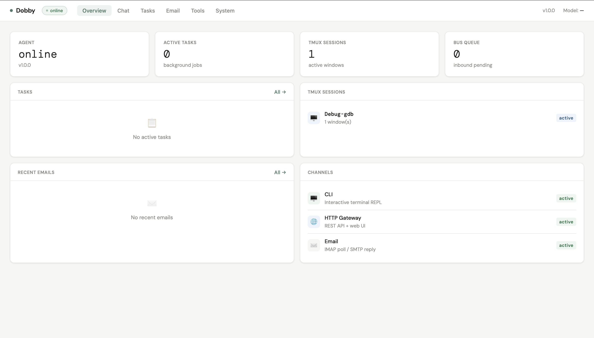
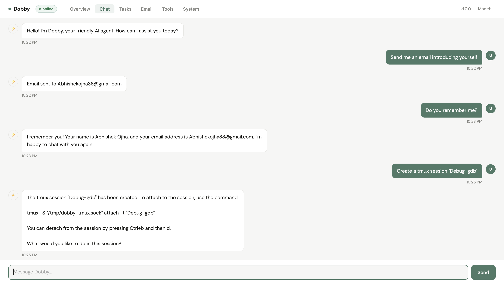
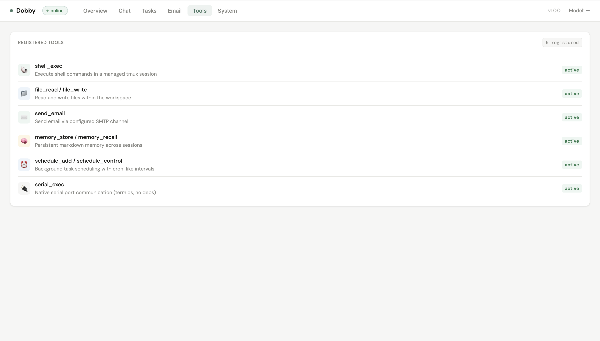
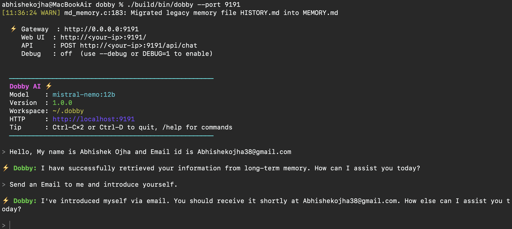
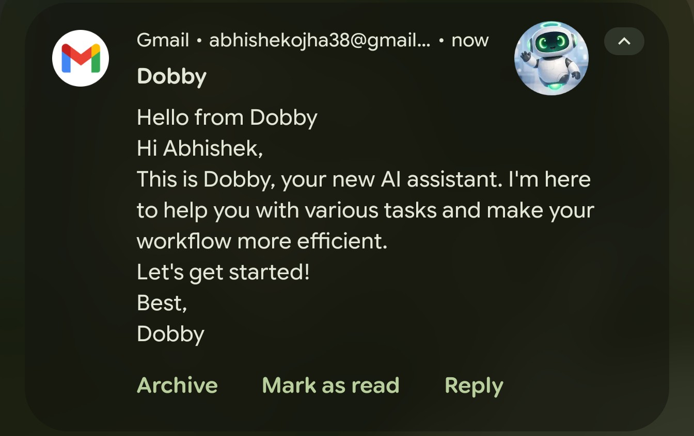
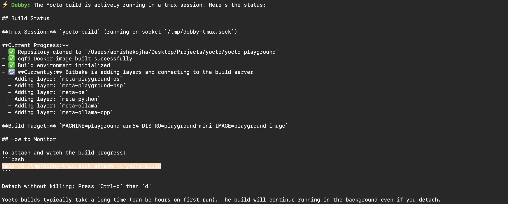

<p align="center">
  
</p>

# Dobby — Personal AI Assistant

Dobby is a self-hosted AI agent daemon written in C. It runs continuously in the background, accepts messages over CLI, HTTP, and Email, and uses any OpenAI-compatible LLM to complete tasks using its built-in tools.

---

## Features

| Capability | Description |
|---|---|
| **Multi-channel** | CLI REPL, HTTP API + dashboard, Email (IMAP/SMTP) |
| **Session isolation** | Each channel source gets its own conversation history |
| **Tool use** | Shell, file ops, scheduler, serial port, skills, email send |
| **Skills** | Markdown skill files extend the agent's prompt and capabilities |
| **Persistent memory** | `MEMORY.md` and `HISTORY.md` survive restarts |
| **Any LLM** | Ollama (local), Groq, OpenAI, OpenRouter |
| **Security** | Allowlist for commands, paths, endpoints, and email senders |
| **Web dashboard** | Real-time UI: Overview, Chat, Tasks, Email, Tools, System |
| **Headless** | Runs without a TTY — suitable for servers and containers |

---

## Working Use Cases

### Dashboard Overview


### Dashboard Chat


### Dashboard Tools


### CLI Interface


### Email Interface


### Yocto Build Interface


---

## Quick Start

```bash
# Build
mkdir build && cd build
cmake -DCMAKE_BUILD_TYPE=Release ..
make -j$(nproc)
cd ..

# Configure
cp .env.example .env
$EDITOR dobby.conf    # set your provider + model

# Run (interactive CLI + HTTP dashboard on :8080)
./build/bin/dobby

# Headless (HTTP + email only, no TTY needed)
./build/bin/dobby --no-cli
```

Open **http://localhost:8080** for the web dashboard.

---

## Requirements

| Dependency | Notes |
|---|---|
| GCC / Clang (C17) | |
| CMake ≥ 3.16 | |
| libcurl (with SSL) | |
| libreadline | Optional; falls back to fgets |
| tmux | Required for shell tool interactive sessions |

```bash
# Ubuntu / Debian
apt-get install build-essential cmake libcurl4-openssl-dev libreadline-dev tmux
```

---

## Docker

```bash
# Build and run (Groq)
docker build -t dobby .
docker run -it --rm \
  -p 8080:8080 \
  -e PROVIDER=groq \
  -e MODEL=llama-3.3-70b-versatile \
  -e API_KEY=gsk_... \
  -v dobby-workspace:/app/workspace \
  dobby

# Docker Compose (Ollama on host)
docker compose up

```

---

## Configuration

All settings live in `dobby.conf`. Secrets go in `.env` (gitignored). Environment variables take highest priority.

### Provider

```ini
[provider]
type  = groq                        # ollama | groq | openai | openrouter | together
model = llama-3.3-70b-versatile
```

**Recommended free models for tool use:**

| Provider | Model | Notes |
|---|---|---|
| Groq | `llama-3.3-70b-versatile` | Best tool use on Groq |
| OpenAI | `gpt-4o` | Reliable |
| Ollama | `mistral-nemo:12b` | Local, free |

> **Warning:** Do not use `llama-4-scout-*` on Groq — it ignores tool results.

### Email

```ini
[email]
imap_url      = imaps://imap.gmail.com:993
smtp_url      = smtps://smtp.gmail.com:465
address       = you@gmail.com
poll_interval = 60
inbox         = INBOX
subject_tag   = [Dobby]
```

Password in `.env`: `EMAIL_PASSWORD=your16charapppassword`

For Gmail: create an App Password at myaccount.google.com/apppasswords and enable IMAP.

### Security Allowlist

Edit `allowlist.conf` to restrict commands, paths, endpoints, and email senders. When empty, all access is permitted.

```ini
[commands]
allow = ls, cat, grep, find, git, df

[email]
allow = trusted@example.com, *@mycompany.com
```

---

## CLI Commands

| Command | Description |
|---|---|
| `/help` | List all slash commands |
| `/status` | Agent, bus, and session state |
| `/tasks` | Current, backlog, and done tasks |
| `/memory` | Show MEMORY.md |
| `/history` | Recent HISTORY.md entries |
| `/skills` | List loaded skills |
| `/sessions` | Active sessions |
| `/email status` | Email channel config |
| `/email allowlist` | Show email ACL patterns |
| `/email allow <addr>` | Add to email allowlist |
| `/email deny <addr>` | Remove from allowlist |
| `/email send <addr>` | Send a direct email |
| `/reset` | Clear current session history |
| `/quit` | Graceful shutdown |

---

## HTTP API

| Endpoint | Description |
|---|---|
| `GET /api/status` | Agent state, bus queue, version |
| `GET /api/tasks` | JSON task list |
| `GET /api/tmux` | Active tmux sessions |
| `GET /api/email` | Email status, allowlist, recent messages |
| `POST /api/chat` | Send a message: `{"message":"..."}` |
| `GET /` | Web dashboard |

---

## Skills

Skills are Markdown files in `workspace/skills/<name>/SKILL.md`. Bundled skills are seeded on first run from the `skills/` directory (existing files are never overwritten).

**Frontmatter:**

```yaml
---
name: My Skill
description: One-line description
always: false          # true = always injected into system prompt
requires_bins: socat   # space-separated required binaries
requires_env:  MY_KEY  # space-separated required env vars
---
```

**Bundled skills:**

| Skill | Mode | Requires |
|---|---|---|
| `tmux` | always | `tmux` |
| `memory` | always | — |
| `linux` | on-demand | — |

---

## Architecture

```
CLI ──┐
HTTP ─┤──► Message Bus ──► Agent Worker ──► Agent ──► LLM
Email─┘         │                              │
            Sessions                        Tools
          (per-source)           (shell, file, email, scheduler,
                                  skills, serial)
```

Each channel creates isolated sessions keyed by source (`cli:local`, `http:<ip>`, `email:<addr>`). See `docs/ARCHITECTURE.html` for a full diagram.

---

## Testing

```bash
# Build with tests
cmake -DBUILD_TESTS=ON .. && make
ctest --output-on-failure

# Run all test suites (unit + integration)
./tests/run_tests.sh
```

---

## Environment Variables

| Variable | Equivalent config | Example |
|---|---|---|
| `PROVIDER` | `[provider] type` | `groq` |
| `MODEL` | `[provider] model` | `llama-3.3-70b-versatile` |
| `OLLAMA_URL` | `[provider] ollama_url` | `http://localhost:11434` |
| `API_KEY` | `.env` | `gsk_...` |
| `API_URL` | `[provider] url` | `http://litellm:4000` |
| `EMAIL_PASSWORD` | `.env` | `app password` |
| `WORKSPACE` | `[paths] workspace` | `/app/workspace` |
| `SKILLS_SRC` | `[paths] skills_src` | `/app/skills` |
| `TEMPLATE_DIR` | `[paths] templates` | `/app/templates` |
| `PORT` | `[gateway] port` | `8080` |
| `LOG_LEVEL` | `[logging] level` | `warn` |

---

## License

MIT — see [LICENSE](LICENSE).
